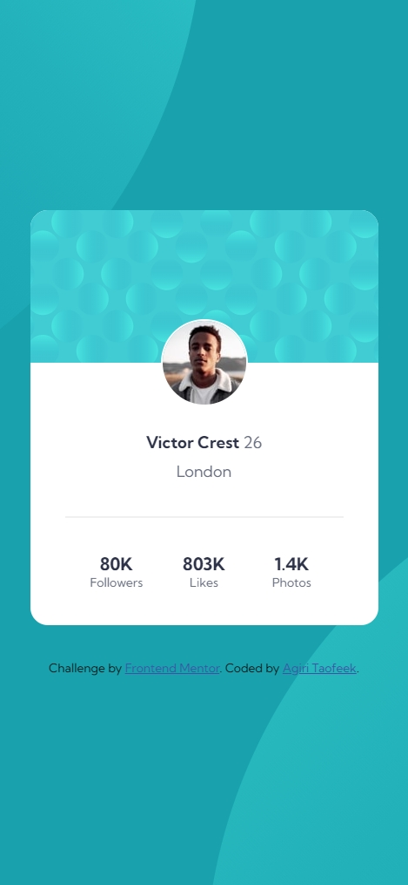
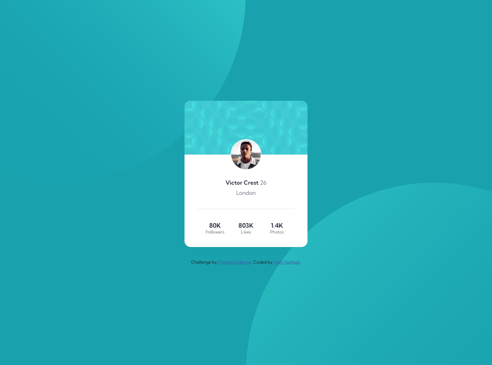

# Frontend Mentor - Profile card component solution

This is a solution to the [Profile card component challenge on Frontend Mentor](https://www.frontendmentor.io/challenges/profile-card-component-cfArpWshJ). Frontend Mentor challenges help you improve your coding skills by building realistic projects. 

## Table of contents

- [Overview](#overview)
  - [The challenge](#the-challenge)
  - [Screenshot](#screenshot)
  - [Links](#links)
- [My process](#my-process)
  - [Built with](#built-with)
  - [What I learned](#what-i-learned)
  - [Continued development](#continued-development)
  - [Useful resources](#useful-resources)
- [Author](#author)
- [Acknowledgments](#acknowledgments)

## Overview
A simple social account profile
### The challenge

- Build out the project to the designs provided

### Screenshot

### Links

- Solution URL: [solution](https://your-solution-url.com)
- Live Site URL: [Live-site](https://heuristic-keller-27a690.netlify.app/)

### Built with

- Semantic HTML5 markup
- CSS custom properties
- Flexbox
- CSS Grid
- Mobile-first workflow

### What I learned
Learnt more about positioning background images

## Author
- Frontend Mentor - [@AgiriTaofeek](https://www.frontendmentor.io/profile/AgiriTaofeek)
- Twitter - [@tolanisirius](https://www.twitter.com/Taofeeqomotolani)

